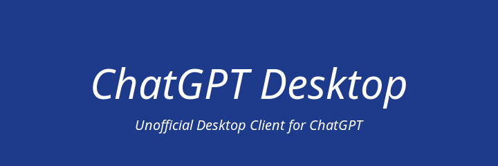

# DeepSeek Desktop

DeepSeek Desktop is a cross-platform desktop application that allows you to use DeepSeek directly on your computer, making it easier to chat with AI while working.

[](https://snapcraft.io/deepseek-linux)



## 🛠 **Features**

DeepSeek Desktop is a lightweight, Electron-based application that brings the power of DeepSeek to your desktop. It provides a seamless and responsive interface for AI-driven conversations. Key features include:

1. **Anonymous Chatting**: Enjoy secure and private interactions without the need for an account.
2. **Secure**: All communications are encrypted, ensuring your data remains private and safe.
3. **Open Source**: The application is open-source, allowing users to contribute and modify the code for their needs.
4. **Cross-Platform**: Available on multiple platforms, ensuring smooth performance and a consistent experience.
5. **DeepSeek Chat**: Access DeepSeek quickly from a dedicated desktop window.

Designed for both casual chats and productivity, DeepSeek Desktop offers an easy and secure way to interact with AI on your desktop.

## 📦 **Installation**

```bash
sudo snap install deepseek-linux
```

### Build From Source

1. **Clone the repository**:

```bash
git clone https://github.com/evildevill/deepseek-linux.git
cd deepseek-linux
```

2. **Install dependencies**: Ensure that you have all the necessary dependencies installed.

```bash
   npm instal
```

3. Start the application:

```bash
npm start
```

4. **Build the application**: Run the following command to create a Snap package of the application.

```bash
npm run dist
```

5. **Change to the dist directory**: Navigate to the dist directory where the Snap package is located.

```bash
cd dist
```

6. **Install the Snap package**: Use the following command to install the Snap package. The `--dangerous` flag allows the installation of locally built packages.

```bash
sudo snap install --dangerous ./deepseek-linux_1.0.0_amd64.snap
```

## ↩️ **Uninstallation Steps**

Remove the Snap package: To uninstall the DeepSeek Desktop application, run the following command:

```bash
sudo snap remove deepseek-linux
```

## 📖 **Usage Instructions**

### **Launching the App**:

After installation, open DeepSeek Desktop using:

```bash
   deepseek-linux
```

## 🤝 **Contributing**

Contributions are welcome! If you'd like to contribute to this project, please fork the repository and submit a pull request.

## 📜 **License**

This project is licensed under the MIT License. See the [LICENSE](./LICENSE) file for details.

## Acknowledgments

- **Electron** - Framework used to build the application.
